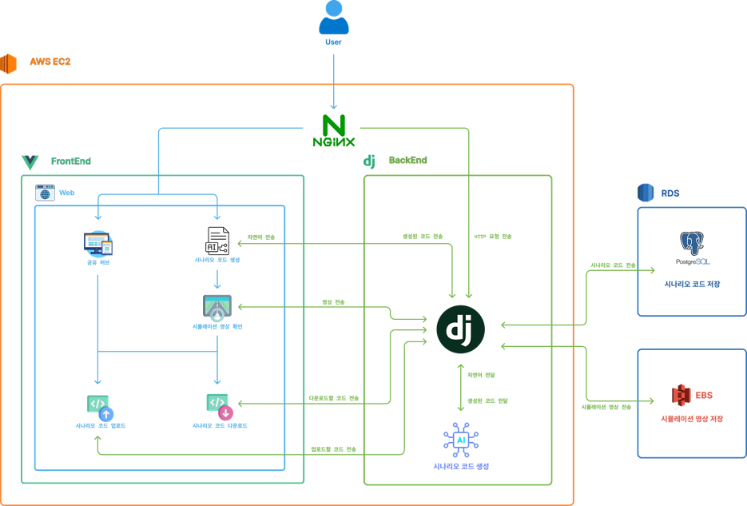

# 🚙 ScenarioHub

## 개요
### 💻 ScenarioHub: 자율주행 시나리오 생성 및 공유 프로젝트

- 생성 부분에서는 원하는 시나리오의 설명을 입력하고, 맵을 선택하면 알맞은 시나리오와 시뮬레이션 영상을 제공합니다.
- 공유 부분에서는 시나리오의 제목, 설명, 태그를 입력하고, 시나리오파일과 맵을 선택해서 업로드 하여 다른 사용자들과 공유할 수 있습니다.
- 생성 후 완성된 파일이 마음에 든다면 해당 시나리오를 바로 업로드하여 공유할 수 있습니다.
## 👨‍💻 기능
- 시나리오 생성 요청 및 생성 상태 조회
- 생성 결과 업로드
- 공유 게시물 탐색/상세 조회
- 좋아요, 다운로드, 비디오 스트리밍
- 내 시나리오 목록 조회

## 🪧 시스템 아키텍처

## 🔧 기술 스택
| **구분** | **기술** |
|------|------|
| **Front-End** | Nuxt, Nuxt server routes, Vue.js, TypeScript, Tailwind CSS 4 |
| **Back-End** | Python, Django 6.0 |
| **Database Driver** | mysqlclient, psycopg, psycopg-binary |
| **Algorithm** | Python |
| **Web Server** | NGINX |
| **Simulator** | Esmini |
| **Dev Tools** | Github, VSCode |
| **JWT** | djangorestframework-simplejwt |
| **Embedding/Model** | FlagEmbedding / transformers |
